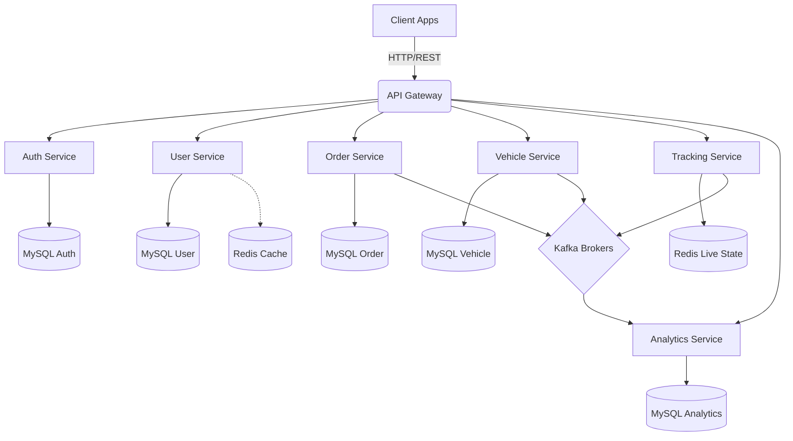
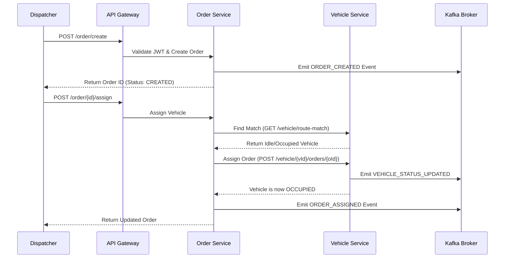
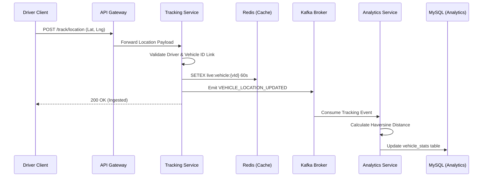

# SmartTMS: Detailed Technical & Functional Flow Documentation

## 1. Executive Summary
The **Smart Logistics & Fleet Intelligence Platform (SmartTMS)** is a cloud-native, microservices-based backend system designed for real-time vehicle tracking, order delivery management, and logistics analytics at scale.

This document serves as an exhaustive breakdown of all microservices, their exact endpoints (functions), data flows, and architectural diagrams.

---

## 2. High-Level Architecture Diagram

---

## 3. Microservices Deep Dive

### 3.1 API Gateway Service (`apigateway-service`)
- **Role**: Entry point for all external traffic on port `7082`.
- **Functions**: Routes requests to specific microservices, validates JWT tokens, and enforces rate limiting. Connects to `eureka-server` for service discovery.

### 3.2 Authentication Service (`auth-service`)
- **Role**: Secure identity management and credential verification. Connects to its own isolated MySQL database.
- **Reference**: [AuthService.java](file:///f:/Gen_Projects/SmartTMS/auth-service/auth/src/main/java/com/smartlogistics/auth/service/AuthService.java)
- **Functions / API Endpoints**:
  - `POST /auth/register`: Registers a new user with secure password hashing.
  - `POST /auth/login`: Validates credentials and returns a stateless JWT token.

### 3.3 User Service (`user-service`)
- **Role**: Manages user profiles (Admin, Dispatcher, Driver, User) and roles.
- **Functions / API Endpoints**:
  - `POST /user/createProfile`: Creates a detailed user profile (Role, Phone, City, etc.).
  - `PUT /user/updateProfile/{authUserId}`: Updates an existing profile.
  - `GET /user/fetchProfile/{authUserId}`: Fetches profile via User ID.
  - `GET /user/fetchProfilesByRole/{role}`: Fetches all user profiles matching a specific role (e.g., `DRIVER`).

### 3.4 Vehicle Service (`vehicle-service`)
- **Role**: Fleet registry and assignment logic. Publishes state changes to Kafka.
- **Functions / API Endpoints**:
  - `POST /vehicle/create`: Registers a new vehicle with origin, destination, and via routes.
  - `PUT /vehicle/update`: Updates basic vehicle information.
  - `GET /vehicle/findIdle`: Returns available/idle vehicles based on location or type.
  - `GET /vehicle/route-match`: Finds vehicles whose routes match an order's `from`/`to`.
  - `POST /vehicle/{vehicleId}/orders/{orderId}`: Manually assigns an order to a specific vehicle.
  - `DELETE /vehicle/{vehicleId}/orders/{orderId}`: Removes an assigned order from a vehicle.
  - `PUT /vehicle/{vehicleId}/status`: Updates vehicle status (`IDLE`, `OCCUPIED`, `IN_TRANSIT`, etc.).
  - `POST /vehicle/assignDriver/{vehicleId}/{driverId}`: Links a driver profile to a vehicle.
  - `POST /vehicle/unassignDriver/{vehicleId}`: Removes driver assignment.
  - `GET /vehicle/{vehicleId}`: Returns vehicle info along with driver data.
  - `GET /vehicle/all/withDrivers`: Lists all vehicles and their linked drivers.
  - `GET /vehicle/occupied/withDrivers`: Lists only occupied vehicles.
  - `GET /vehicle/driver/{driverId}/currentVehicle`: Finds which vehicle a driver is currently assigned to.

### 3.5 Order Service (`order-service`)
- **Role**: Order Lifecycle state machine. Emits lifecycle events (`ORDER_CREATED`, `ORDER_ASSIGNED`, etc.) to Kafka.
- **Functions / API Endpoints**:
  - `POST /order/create`: Initiates an order (Dispatcher only). State: `CREATED`.
  - `POST /order/{orderId}/assign`: Automatically finds a route-matching vehicle and assigns the order.
  - `PUT /order/{orderId}/status`: Advances the state (e.g., `IN_TRANSIT`, `DELIVERED`).
  - `GET /order/{orderId}`: Fetches a single order's details.
  - `GET /order/all`: Fetches the entire order list.

### 3.6 Tracking Service (`tracking-service`)
- **Role**: High-velocity GPS ingestion endpoint for active fleets. Stores live coordinates in Redis (with TTL) and pushes events to Kafka.
- **Functions / API Endpoints**:
  - `POST /track/location`: Ingests GPS telemetry (lat, lng, speed, heading) from driver apps.
  - `GET /track/vehicle/{vehicleId}`: Queries Redis for the latest real-time coordinates.
  - `GET /track/order/{orderId}`: Retrieves order-linked tracking context.

### 3.7 Analytics Service (`analytics-service`)
- **Role**: Decoupled consumer for Business Intelligence. Consumes Kafka events to aggregate total mileage, averages, and statistics into specific MySQL tables without loading the operational databases.
- **Functions / API Endpoints**:
  - `GET /analytics/overview`: High-level metrics (active vehicles, in-transit orders).
  - `GET /analytics/vehicle/{vehicleId}`: Vehicle-specific metrics (total distance traveled).
  - `GET /analytics/order/{orderId}`: Delivery performance and lifecycle timestamps.
  - `GET /analytics/driver/{driverId}`: Driver workload, utilization, and distance stats.
  - `GET /analytics/summary/assignment-time`: Average system assignment times.
  - `GET /analytics/summary/routes`: Route volume metrics.
  - `GET /analytics/summary/drivers`: Driver utilization summaries.

### 3.8 Notification Service (Phase 2 Future Scope)
- **Role**: Planned for centralized email and in-app notifications reacting to Kafka events (`ORDER_DELIVERED`, `TRACKING_STALE`).

---

## 4. End-to-End Business Workflows

### 4.1 Order Assignment Sequence
When an order is created and assigned, multiple services interact to maintain state integrity.

### 4.2 Real-time Tracking & Analytics Flow
The ingestion pipeline emphasizes speed and decoupling.

---

## 5. Event-Driven Data Integration Details

The platform heavily relies on Event-Driven principles to keep services loosely coupled.

- **Kafka Topics Used**:
  - `vehicle-location-events`: Partitioned by `vehicleId` to guarantee coordinate ordering. Used heavily by Tracking to push coordinates.
  - `order-events`: Handles `ORDER_CREATED`, `ORDER_ASSIGNED`, `ORDER_IN_TRANSIT`, and `ORDER_DELIVERED`.
  - `vehicle-events`: Handles `DRIVER_ASSIGNED_TO_VEHICLE` and `VEHICLE_STATUS_UPDATED`.
- **Redis Strategy**: 
  - User profiles are cached to avoid hammering the MySQL user DB during JWT validation.
  - Live coordinates are saved with a 60-second TTL. If a vehicle drops off the network, the TTL expires preventing "ghost tracking".
- **Database Segregation**:
  - `auth-service`, `user-service`, `vehicle-service`, `order-service`, and `analytics-service` each maintain distinct schema structures in MySQL, guaranteeing that analytical complex queries (`GROUP BY`) do not bottleneck the operational fleet APIs.

---

## 6. Conclusion
The SmartTMS platform implements a robust event-driven microservice architecture capable of scaling both ingest-heavy components (like tracking GPS heartbeats) and complex state machines (Order delivery cycles). The comprehensive API surface handles everything from granular fleet assignment logic to cross-cutting metrics compilation via asynchronous background pipelines.
